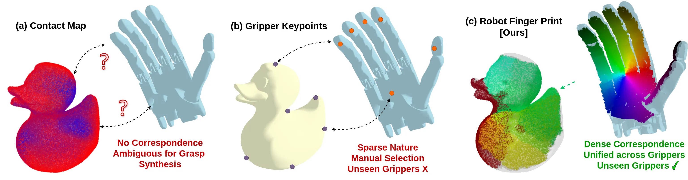
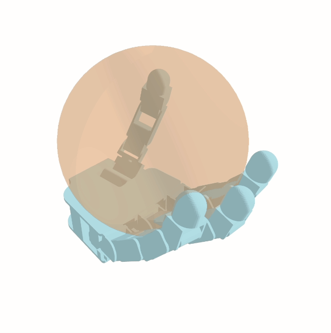
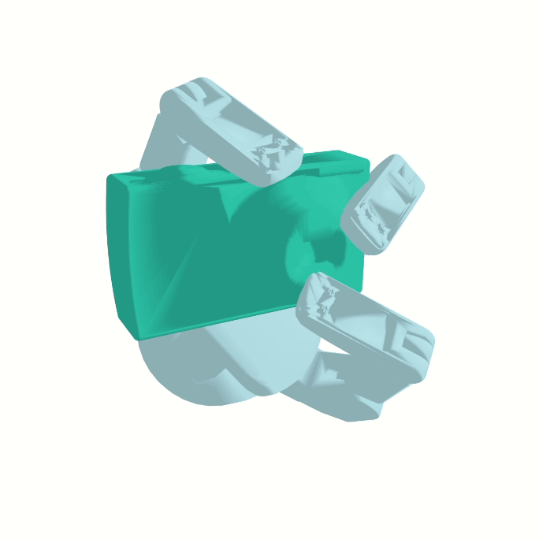

# RobotFingerPrint 

RobotFingerPrint: Unified Gripper Coordinate Space for Multi-Gripper Grasp Synthesis​

Ninad Khargonkar, Luis Felipe Casas, Balakrishnan Prabhakaran, Yu Xiang

[Paper (arXiv)](https://arxiv.org/abs/2409.14519) | [Video](https://youtu.be/qvyhMjGf46I?feature=shared) | [Project website](https://irvlutd.github.io/RobotFingerPrint/)

> Multi embodiment generalizable grasping method across grippers with different number of fingers.



## Setup

- The overall flow and evaluation setup is adapted from [GenDexGrasp](https://github.com/tengyu-liu/GenDexGrasp).
- Set a symbolic link to GenDexGrasp dataset under `./dataset/GenDexGrasp/`
  - Check the associated data files README from [here](https://utdallas.box.com/v/RobotFingerPrint-Data)
  - The above folder will also have the training and inference log files for reference
- Create conda python env via the `envrionment.yml`


### Note
This repo includes  self-contained src code for the maximal spheres for grippers and testing grasps in isaacgym. Please check their individual folders for reference and setup:

> For grasp simulation test based on GenDexGrasp, see: `grasp-test-isaacgym/`

> For computing maximal spheres for gripper, see: `grasp-maximal-sphere/`

Sphere Grasping example:



## RFP Scripts

- Training: `python gdx_train_gcs.py` 
  - Args used: `--n_epochs 16 --ann_temp 1.5 --ann_per_epochs 2`
  - Optionally, for unseen gripper models: use the `--disable_[GripperName]` flage (example: `--disable_shadowhand`).
  - See `--help` for more details

- Coordinate Map Inference: `gcs_gdx_inf_cvae.py`
  - Use the desired log dir generated by the training script with `--logdir`
  - Use the desited checkpoint name with `--ckpt` (e.g. `best_val.pt`, or `latest.pt`) 
  - Other args used: `--num_per_unseen_object 64`
  - See `--help` for more details

- Grasp Generation for target gripper: `gcs_gdx_grasp_gen.py`
  - `--logdir, --inf_dir`: Point to the logging and dir where the inference maps are stored
  - `--max_iter`: we used 100 steps
  - See `--help` for more details

- Grasp Evaluation:
  - We used the GenDexGrasp isaac gym evaluation setup with `learning_rate=0.1` and `step_size=0.02` for the grasp evaluation params for each gripper (inside the env script, under `_set_normal_force_pose()` method). 
  - See the `grasp-test-isaacgym` self-contained folder for more details.


Generated grasp example after the grasp optimzation process:



## Citing RFP

```bibtex
@inproceedings{khargonkar2024robotfingerprint,
title={RobotFingerPrint: Unified Gripper Coordinate Space for Multi-Gripper Grasp Synthesis​},
author={Khargonkar, Ninad and Casas, Luis Felipe and  and Prabhakaran, Balakrishnan and Xiang, Yu},
journal={arXiv preprint arXiv:2409.14519},
year={2024}
}
```

