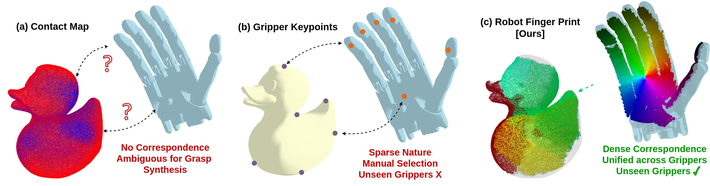
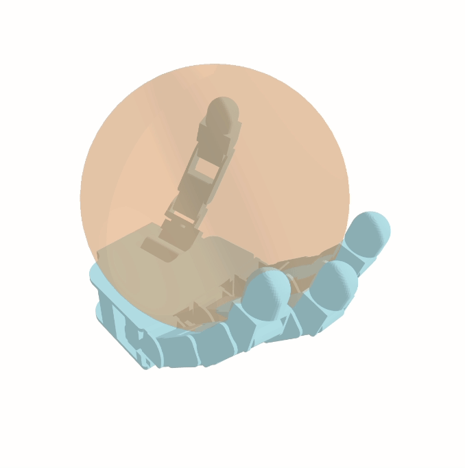
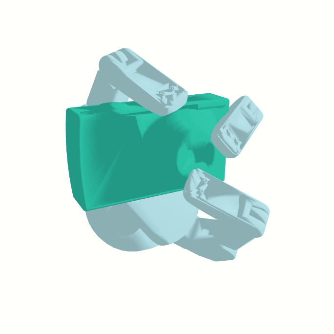
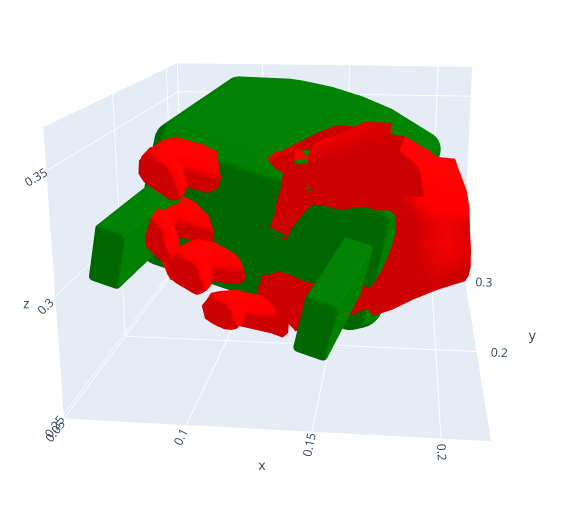
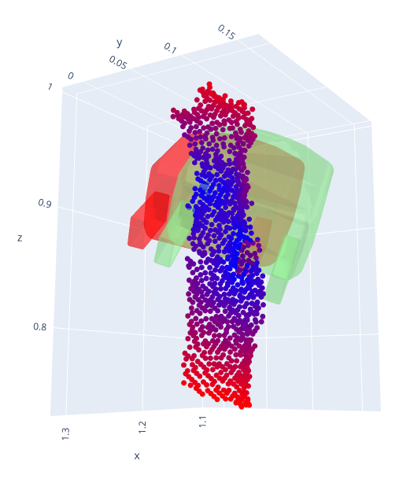

# RobotFingerPrint 

**RobotFingerPrint: Unified Gripper Coordinate Space for Multi-Gripper Grasp Synthesis​**

Authors: Ninad Khargonkar, Luis Felipe Casas, Balakrishnan Prabhakaran, Yu Xiang

Links: 
[Paper (arXiv)](https://arxiv.org/abs/2409.14519) | 
[Video](https://youtu.be/qvyhMjGf46I?feature=shared) | 
[Project website](https://irvlutd.github.io/RobotFingerPrint/)

> Multi embodiment generalizable grasping method across grippers with different number of fingers.



**Index**

- [Setup](#setup)
  - [Dataset Preparation](#dataset-preparation)
  - [Mano Pybullet](#mano-pybullet)
  - [Possible Issues](#possible-issues)
  - [Simulation Env: Maximal Sphere and Grasp Test](#simulation-env-maximal-sphere-and-grasp-test)
  - [Code Layout](#code-layout)
- [RFP Model: Training and Inference](#rfp-model-training-and-inference)
- [RFP Standalone: Grasp Transfer and Optimization](#rfp-standalone-grasp-transfer-and-optimization)
  - [Grasp Transfer](#grasp-transfer)
  - [Grasp Optimization](#grasp-optimization)
- [Citing RFP](#citing-rfp)


# Setup

```bash
git clone https://github.com/IRVLUTD/robot-finger-print.git --recursive
```

**Acknowledgements**: [GenDexGrasp](https://github.com/tengyu-liu/GenDexGrasp)
code repository.

- Create conda python env via the `envrionment.yml`.
```bash
conda env create -f environment.yml
```

- The overall flow and evaluation setup is adapted from [GenDexGrasp](https://github.com/tengyu-liu/GenDexGrasp).

## Dataset Preparation

- Download and extract the GenDexGrasp dataset zip to a desired location (for example: `~/Datasets/GenDexGrasp`) 
- Set a symbolic link to GenDexGrasp dataset under `./dataset/GenDexGrasp/`:

```
mkdir dataset
ln -s ~/Datasets/GenDexGrasp ./dataset/GenDexGrasp
```

- Download the UGCS related data files from [here](https://utdallas.box.com/v/RobotFingerPrint-Data).
  - This contains files like the generalized coordinates for different grippers, object point clouds + normals, and the coordinates for each grasp from GenDexGrasp dataset. 
  - Please check the [Dataset README](https://utdallas.box.com/v/RFPv1-PublicData-README) in the link for correctly placing the data files and general information about what each file represents.

## Mano Pybullet

We have the `mano_pybullet` added as a submodule which you can install by 
following steps. This module is included since we used this create a mano hand
urdf from the original mano models. It also gives some utility functions to
convert the mano hand parameters.

- `cd mano_pybullet`

- `pip install -e .`

- Please go through its README and test the functionality using the `gui_control` tool. 
  - You will need to set the `MANO_MODELS_DIR` env var to the path for extracted mano models dir.
  - Example: `export MANO_MODELS_DIR=/home/ninad/Projects/MANO/MANO_Hand_Model/mano_v1_2/models` in command line
  - OR in ipython notebook as: `%env MANO_MODELS_DIR=/home/ninad/Projects/MANO/MANO_Hand_Model/mano_v1_2/models`


## Possible Issues

> Run `pip install --upgrade networkx` if urchin URDF loading gives an error.

> While setting up `mano_pybullet`, if you see an error like `ImportError: cannot import name 'bool' from 'numpy'`. 
> Try: `pip install git+https://github.com/mattloper/chumpy`. [(Link to github issue)](https://github.com/mattloper/chumpy/issues/55)

> If you see `ImportError` with `omegaconf` arising from lighting's tensorboard logger, try changing the version of omegaconf installed. 

## Simulation Env: Maximal Sphere and Grasp Test 
This repo includes  self-contained source code for the maximal spheres for 
grippers and testing grasps in isaacgym. Please check their individual folders
for reference and setup:

- For grasp simulation test based on GenDexGrasp, see: `grasp-test-isaacgym/`

- For computing maximal spheres for the grippers, see: `grasp-maximal-sphere/`

Sphere Grasping example:




## Code Layout

- The core functionality is implemented in `model/`, specifically `hand_model.py` and `hand_opt.py`.

  - `hand_model.py` creates a differentiable kinematics model for a gripper given its URDF

    - Can use the [`GcsHandModel`](./model/hand_model.py/) defined in it as a standalone separately if needed!

  - `hand_opt.py` poses the grasp transfer as an optimization problem and provides wrappers for both logging and optimization.

    - The wrappers are for convenience, and the core optimization loop defined in [`GcsGraspTransferOpt`]('./model/hand_opt.py')

- `utils` includes some commonly used functions, importantly there are some utilities which can help with pose alignment between different grippers, and some rotation conversions.

  - `utils/grasp_utils.py`: gripper pose alignment to a common space -- useful for transferring grasps. Note, the values for each gripper are tuned according to the urdf models provided under `grippers/` dir. 
  - If your urdf is different from the ones provided, then you may need to define a custom alignment function: 
  - (1) hand palm normal should be +Z, (2) major axis for palm should be +Y, (3) hand origin should be on palm surface

- Gripper urdfs are under `grippers/`. Also included are files like:

  - `mgg_gripper_surface_pts.pk`: pickled dict containing the pre-selected interior surface points for the gripper along with their unified coordinates used for correspondence and transfer.

  - NOTE: The mano hand urdfs were created using the `mano_pybullet` repository.

  - And some other files for legacy reasons...


# RFP Model: Training and Inference

- Training: `python gdx_train_gcs.py` 
  - Args used: `--n_epochs 16 --ann_temp 1.5 --ann_per_epochs 2`
  - Optionally, for unseen gripper models: use the `--disable_[GripperName]` flage (example: `--disable_shadowhand`).
  - See `--help` for more details

- Coordinate Map Inference: `gcs_gdx_inf_cvae.py`
  - Use the desired log dir generated by the training script with `--logdir`
  - Use the desited checkpoint name with `--ckpt` (e.g. `best_val.pt`, or `latest.pt`) 
  - Other args used: `--num_per_unseen_object 64`
  - See `--help` for more details

- Grasp Generation for target gripper: `gcs_gdx_grasp_gen.py`
  - `--logdir, --inf_dir`: Point to the logging and dir where the inference maps are stored
  - `--max_iter`: we used 100 steps
  - See `--help` for more details

- Grasp Evaluation:
  - We used the GenDexGrasp isaac gym evaluation setup with `learning_rate=0.1` and `step_size=0.02` for the grasp evaluation params for each gripper (inside the env script, under `_set_normal_force_pose()` method). 
  - See the `grasp-test-isaacgym` self-contained folder for more details.

Generated grasp example after the grasp optimization process:




# RFP Standalone: Grasp Transfer and Optimization
The gripper correspondences imposed by RFP can also be used for transferring and
optimizing grasps across different grippers without any manual re-targeting and 
in a **standalone** fashion from the learned model.  

## Grasp Transfer 
Please see `notebooks/example_grasp_transfer.ipynb` for a usage example on 
grasp transfer.

> See the `GcsGraspTransferOpt` under `model/hand_opt.py` for the implementation.

- The grasp transfer is supported between robot grippers under `grippers/` dir. 

- The input to grasp transfer object `GcsGraspTransferOpt` requires: (1) source and target gripper names, (2) source gripper grasp q

- Here grasp `q` refers to a `(9+d)` dimensional tensor where its broken down as:

  - `q[0:3]`: gripper base link translation vector with the grasp
  - `q[3:9]`: gripper base link orientation, represented as a 6d vector of two orthogonal components (think first 2 columns of a rotation matrix, in order like {x1,x2,x3,y1,y2,y3})
  - `q[9:d]`: joint values for `d` joints on the source gripper (so in essence `d ~ DOFS`)

> Here is a visualization of the grasp transfer between 2 grippers.



## Grasp Optimization
Please see the ipython notebook under `notebooks/example_grasp_opt.ipynb` for a 
usage example on grasp optimization with a partial object point cloud and 
noisy initial Fetch gripper grasp. You can extend the similar flow to other 
grippers as well. 

> See the `HandObjectGraspOpt` under `model/hand_opt.py` for the implementation.

- The grasp `q` is broken down as above. For fetch gripper we keep it in the
  open configuration during optimization.

- Given an object point cloud, and some noisy initial grasp (transferred from
  human grasp for example): we can optimize to a potentially non-colliding
  version by using the grasp optimization.

- We use the initial grasp to create a *dummy* contact goal on the object point
  cloud and then optimize towards a final grasp. 

- Please take a look at the ipython notebook with its comments for more details!

> Here is a visualization of the optimization result. Red color represents the
> original noisy grasp and green represents post-optimization version:



# Citing RFP

If this work helps in your research, please consider citing it:

```bibtex
@inproceedings{khargonkar2024robotfingerprint,
title={RobotFingerPrint: Unified Gripper Coordinate Space for Multi-Gripper Grasp Synthesis​},
author={Khargonkar, Ninad and Casas, Luis Felipe and  and Prabhakaran, Balakrishnan and Xiang, Yu},
journal={arXiv preprint arXiv:2409.14519},
year={2024}
}
```

Thank you for taking a look at this repository! Any feedback and comments are 
welcome!

