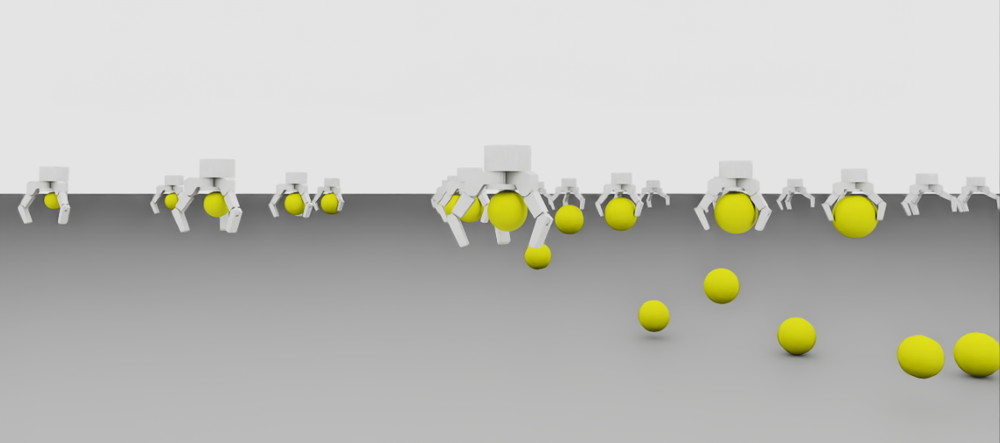

# Max Graspable Sphere Simulation for Different Grippers

Max Sphere simulation for determining the biggest sphere a gripper is able to grasp. The simulation is a simplified, repurposed version of our [MultiGripperGrasp Toolkit](https://github.com/IRVLUTD/isaac_sim_grasping) using Isaac Sim 2023.1.1. For more details on how the different parts of the code work please refer to the link above. 

## Prerequisites

This code was tested with Isaac Sim 2023.1.1 on Linux.


## Installation

1. Install the Isaac Sim 2023.1.1 and cd to its python directory:
   Follow the instructions in the [Isaac Sim Website](https://docs.omniverse.nvidia.com/isaacsim/latest/installation/install_workstation.html) for proper installation.
    Normally the python.sh is on the following directory:
    ```Shell
    cd ~/.local/share/ov/pkg/isaac_sim-2023.1.1
    ```

2. Install the required libraries using the Isaac Sim python environment:
   ```Shell
    ./python.sh -m pip install tqdm
    ```
    Note: Only tqdm must be installed, all other libraries should come with the Isaac Sim version.


## Usage

We have included all our gripper .usd files within the [grippers](grippers) folder; for use of any other gripper please add its .usd to the folder and it's relevant information to the [gripper_isaac_info.json](grippers/gripper_isaac_info.json) file (refer to the Multigripper Grasp repository for more information). 


### Parameters and Inputs
The standalone application for the simulation is the [sphere_st.py](sphere_st.py) file. A sample command to run the simulation is shown below along with the available options. Note: for Isaac Sim standalone executables, the commands must be run from the isaac sim python.sh directory.

The standalone.py takes as input:
- gripper_dir: Gripper directory (folder containing all the gripper .usd folders)
- output_dir: Output directory (directory to save the results .json file)
- num_w: Number of Workstations to run simultaneously (object-gripper pair) (default: 150)
- test_time: Total test time for each grasp test (default:3).
- init_r: Smallest sphere radius, the simulation will start from this radius and spawn num_w spheres to each gripper with an increment of step_size for each workstation/gripper. Units: meters (default: 0.03)
- step_size: step size between each sphere radius. Units: meters (default: 0.005)
- gripper_ID: gripper ID to run the simulation with; must be exactly the key of the gripper in [gripper_isaac_info.json](grippers/gripper_isaac_info.json).
- sphere_mass: Spheres' mass. Units: kg (default: 0.1)
- (Optional) device: GPU device to use for Isaac Sim (default: 0)
- (Optional) headless: Run the simulation headless. We recommend to run the simulation with head to finetune the grasps of every gripper. 

Note: To run the simulation without warnings add the following parameters to the command: 
```Shell
 --/log/level=error --/log/fileLogLevel=error --/log/outputStreamLevel=error
```

Sample run command:
```Shell
./python.sh /home/felipe/Documents/max_sphere/sphere_st.py --gripper_dir=/home/felipe/Documents/max_sphere/grippers --output_dir=/home/felipe/Documents/max_sphere_results --num_w=30 --test_time=3 --init_r=0.0625 --step_size=0.0025 --gripper_ID=Allegro --/log/level=error --/log/fileLogLevel=error --/log/outputStreamLevel=error 
```


<p align="center">

</p>

### Output
A [sample output](sample_results.json) file is available for to facilitate explanation. The simulation output is saved in a dictionary, upon loading the sample result you will notice the following keys:

- gripper: gripper_ID
- controller: Type of controller used for the results.
- test_time: Test time ran.
- contact_names: Gripper Link names to count for grasp initialization (Please refer to the [MultiGripperGrasp Toolkit](https://github.com/IRVLUTD/isaac_sim_grasping) for more information).
- "X": the other keys are the radii of every sphere tested, each key has a dictionary within it with:
  - status: FAILED or PASSED
  - sphere_radius: float value of sphere radius
  - extra grasp information: In the case of being a PASSED sphere it will also include extra information about the grasp such as: joint values, contact points, normals, etc.


### Notes
- Deactivate conda if you have an active environment, it may cause some errors when running isaac sim.
- Always use complete paths for the directories, errors may occur otherwise.
