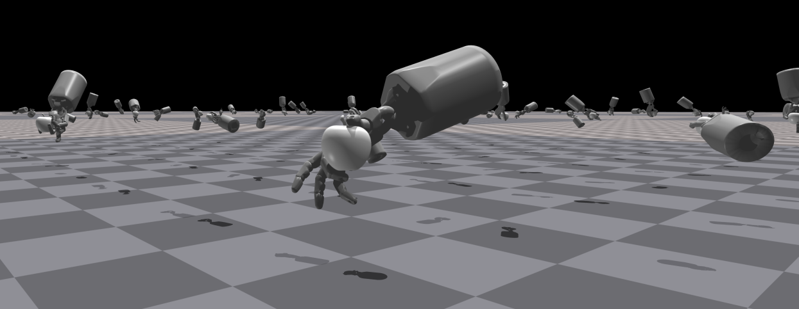

# GenDexGrasp Tests using IsaacGym 

A forked version of the [GenDexGrasp paper repository](https://github.com/tengyu-liu/GenDexGrasp?tab=readme-ov-file). This version just includes the code used for evaluating grasps. We found a couple of bugs when running the original code so we include this folder to facilitate the reproduction of our results. Please cite the GenDexGrasp authors if any of the code in this folder is used.
```
@article{li2022gendexgrasp,
  title={GenDexGrasp: Generalizable Dexterous Grasping},
  author={Li, Puhao and Liu, Tengyu and Li, Yuyang and Zhu, Yixin and Yang, Yaodong and Huang, Siyuan},
  journal={arXiv preprint arXiv:2210.00722},
  year={2022}
}
```

The tests are runned using an old version of [Isaac Gym](https://developer.nvidia.com/isaac-gym). It consists of applying forces on the generated grasps. If after applying any force to the objects there is a displacement greater than 2cm, the grasps is considered as failed. The forces are in the direction of the +/- x,y and z world axes and are applied for 1 second each. The simulation steps run at 60 Hz; for more information please refer to the original [repository](https://github.com/tengyu-liu/GenDexGrasp?tab=readme-ov-file). 

## Installation

- Download and install the Isaac Gym Preview 4 release from [Isaac Gym](https://developer.nvidia.com/isaac-gym), follow the installation steps to create a new conda environment (A conda environment will simplify things).

- Install the requirements listed in requirements.yaml within the Isaac Gym conda environment using the following command:

```Shell
    conda install --file requirements.yaml
```

## Running Tests
The `run_grasp_test.py` script is used to run the grasping tests described in the [GenDexGrasp paper](https://arxiv.org/abs/2210.00722), it is a slightly altered version of their script. Feel free to use their version since its practically the same except, the change in the simulation refinement step where we change the parameters for 1-step gradient descent with `step_size=0.02` and `learning_rate=0.1` which differs from the values used by GenDexGrasp. Additionally `run_grasp_test.py` can use the grasp optimization results in a single folder which should simply things when testing grasps.

It takes the following arguments:

- robot_name: name of the gripper to be used (ezgripper, barrett or shadowhand)
- data_dir: folder path containing all the `grasps.pt` files to test (result from the grasp optimization)
- object_list: .json file path with list of objects to evaluate (just uses the objects under the 'validate' dictionary key) [file link](split_train_validate_objects.json).
- output_dir: directory save the results to.
- output_name: name of .json file where results will be printed.
- filtered: Boolean argument to signal if the .pt files contain all the generated grasps for an object gripper pair or if they have already been filtered (using minimum energy). 
- headless: Boolean argument to run the simulation headless.

An example run command is shown below:

```sh
python run_grasp_test.py --output_dir=./results --object_list=./split_train_validate_objects.json --filtered --robot_name=ezgripper --data_dir=[GRASP_OPT_RESULT_DIR] --output_name=unseen_ezgripper
```

Note: 
- The result file structure is the same as in the original GenDexGrasp repository. 
- The data folder only includes the necessary files to run the ezgripper, barrett and shadowhand grippers with the validation objects listed the [object set file](split_train_validate_objects.json).
